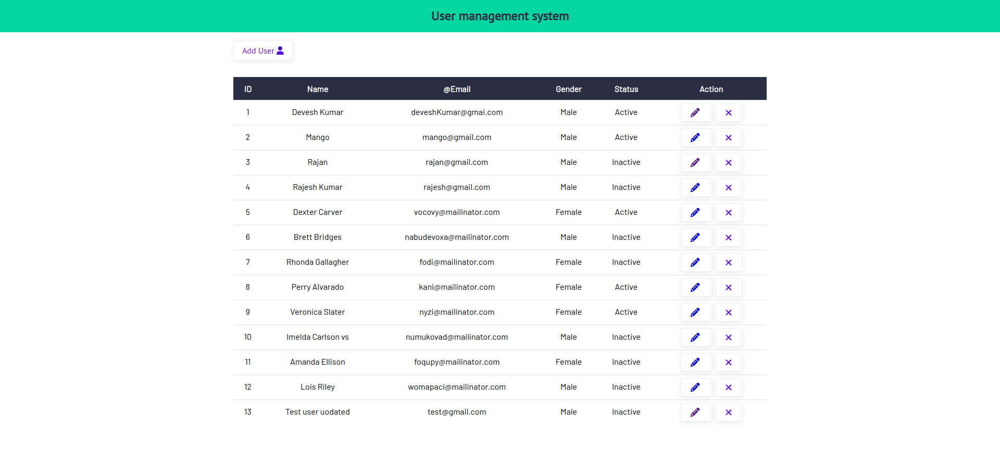
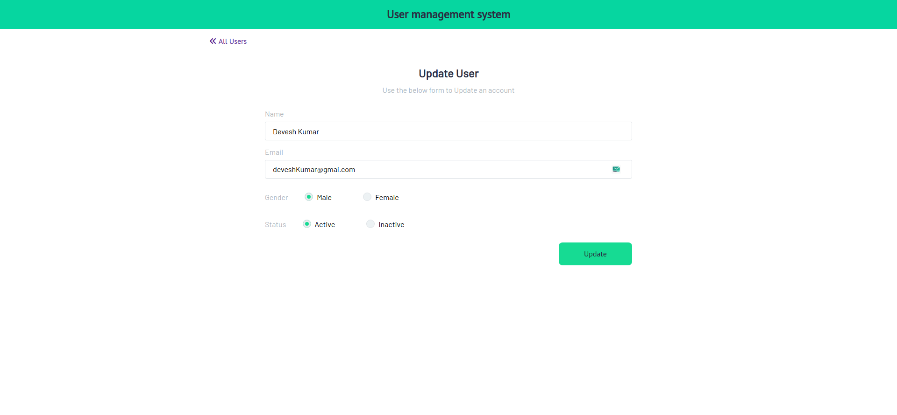
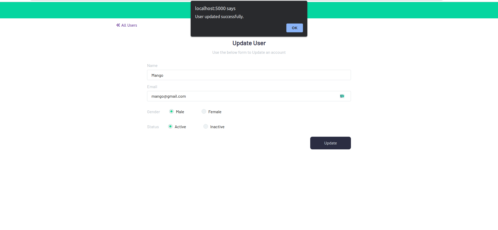
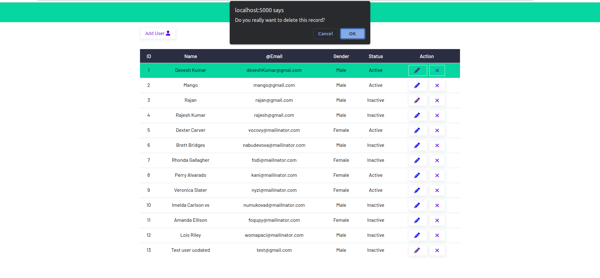
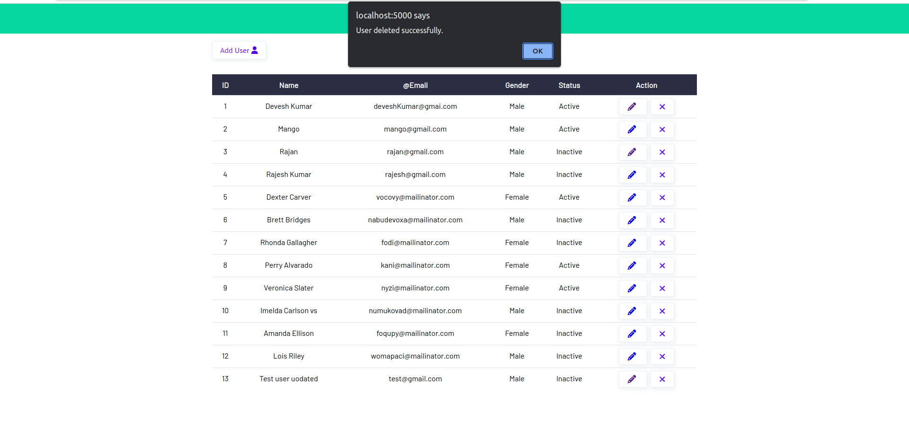

### Get all users


### Add user


### Update user




### delete user





# crud-by-nodejs
Crud operation using node js

### 1
We need these dependencies 
please following:
```
    npm install express   
```

### 1.1

please install development `nodemon` to start the server or local
```
    npm install nodemon --save-dev
```

### 1.2
please install mongoDB to manage the database and operations

```
    npm install MongoDB
    npm install mongoose
```

### Install Mongo DB and setup
Step:
- sudo dpkg -i mongodb-org-server_6.0.6_amd64.deb
- sudo systemctl status mongod
- sudo systemctl start mongod
- sudo systemctl status mongod
- sudo dpkg -i mongodb-mongosh_1.10.1_amd64.deb
- mongosh
- sudo dpkg -i mongodb-compass_1.38.0_amd64.deb

### Install Axios
- npm install axios
